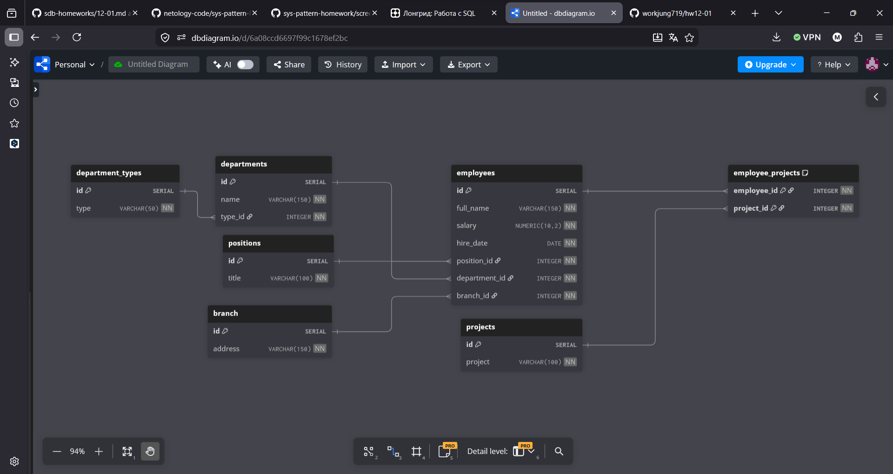
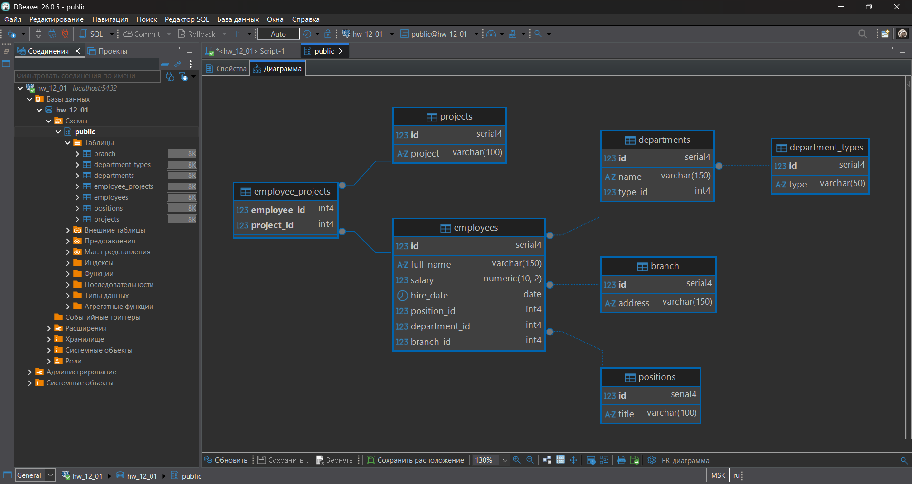

# Домашнее задание к занятию "Базы данных" - Лазебный Кирилл

### Задание 1

Описываем таблицы из которых состоит база данных.

В отправленном заказчиком Excel файле можно описать следующие таблицы:

```SQL
CREATE TABLE positions (
id SERIAL PRIMARY KEY,
title VARCHAR(100) NOT NULL
);

CREATE TABLE department_types (
id SERIAL PRIMARY KEY,
type VARCHAR(50) NOT NULL
);

CREATE TABLE branch (
id SERIAL PRIMARY KEY,
address VARCHAR(150) NOT NULL
);

CREATE TABLE projects (
id SERIAL PRIMARY KEY,
project VARCHAR(100) NOT NULL
);

CREATE TABLE departments (
id SERIAL PRIMARY KEY,
name VARCHAR(150) NOT NULL,
type_id INTEGER NOT NULL,
FOREIGN KEY (type_id) REFERENCES department_types(id)
);

CREATE TABLE employees (
id SERIAL PRIMARY KEY,
full_name VARCHAR(150) NOT NULL,
salary NUMERIC(10, 2) NOT NULL,
hire_date DATE NOT NULL,
position_id INTEGER NOT NULL,
department_id INTEGER NOT NULL,
branch_id INTEGER NOT NULL,
FOREIGN KEY (position_id) REFERENCES positions(id),
FOREIGN KEY (department_id) REFERENCES departments(id),
FOREIGN KEY (branch_id) REFERENCES branch(id)
);

CREATE TABLE employee_projects (
employee_id INTEGER NOT NULL,
project_id INTEGER NOT NULL,
PRIMARY KEY (employee_id, project_id),
FOREIGN KEY (employee_id) REFERENCES employees(id),
FOREIGN KEY (project_id) REFERENCES projects(id)
);
```



---

### Задание 2

База данных успешно развернута локально в PostgreSQL. SQL-скрипт выполнен, таблицы и связи созданы.




---
